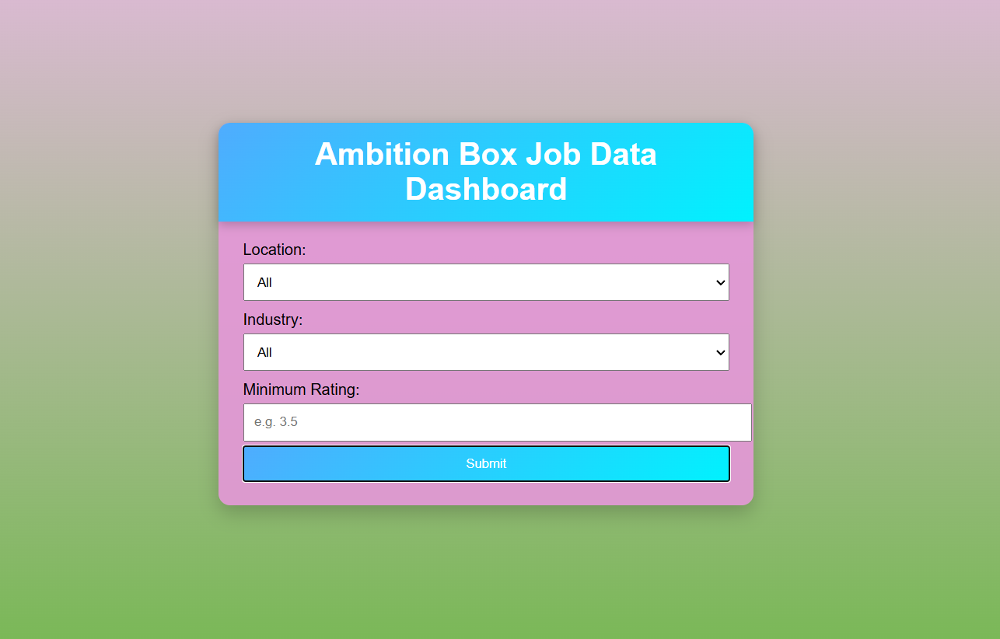
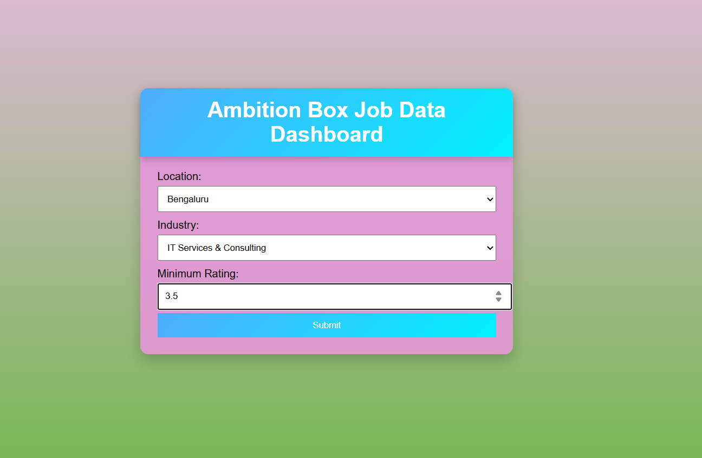
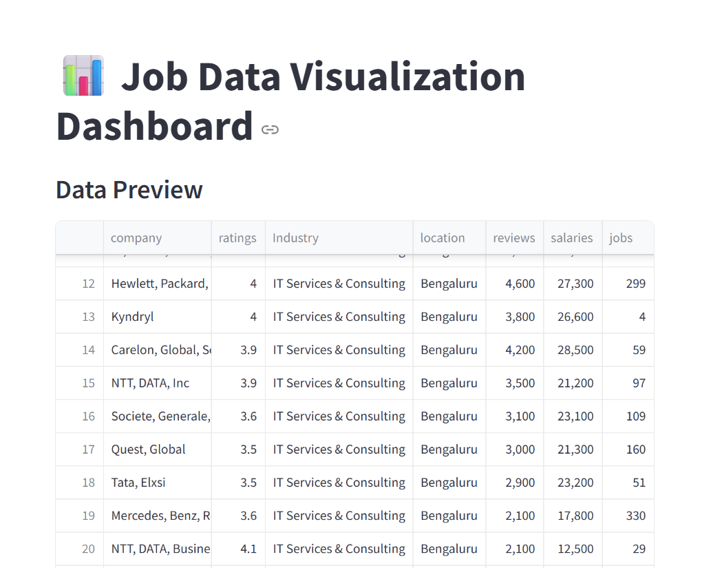

# 💼 AmbitionBox Job Data Analytics Dashboard

## 📊 Project Overview

This project is a **AmbitionBox Job Data Analytics Dashboard** built using **Flask, Pandas, and Streamlit**.
It allows users to filter job data and visualize insights through **interactive tables and graphs**.

The dataset is collected from **AmbitionBox** and used for data analysis and visualization.

### Project Screenshot



[📖 View PDF](Project_screenshot/streamlit_app.pdf)


---

## 🚀 Features

### 🔹 Flask Web Application

* User-friendly UI with dropdown filters:

  * 📍 Location
  * 🏭 Industry
  * ⭐ Minimum Rating
* Dynamic filtering using Pandas

---

### 🔹 Streamlit Dashboard

* Interactive data visualization
* Displays filtered dataset
* Includes multiple graphs:

  * 📊 Jobs by Location (Bar Chart)
  * 🏭 Jobs by Industry (Bar Chart)
  * ⭐ Company vs  Rating
  * 🏢 Company vs Number of Jobs
  * 📈 Rating Distribution (Histogram)
  *  📈 salary Distribution (Histogram)
---

## 🛠️ Tech Stack

* **Python**
* **Flask**
* **Pandas**
* **Streamlit**
* **Matplotlib**
* **HTML / CSS**


---


## ▶️ Run the Project

### 🔹 Run Flask App

```
python app.py
```

👉 Open: http://127.0.0.1:5000

---

### 🔹 Run Streamlit Dashboard

```
streamlit run streamlit_app.py
```

👉 Open: http://localhost:8501

---

## 🔄 Project Workflow

1. User selects filters in Flask UI
2. Flask filters CSV data using Pandas
3. Filtered data saved as `ddataset/show_visualization_data.csv`
4. Streamlit reads filtered data
5. Displays interactive charts and insights

---

## 📊 Sample Use Cases

* Analyze job distribution by location
* Compare industries based on job availability
* Identify top-rated companies
* Explore rating trends

---


---

## ⭐ Conclusion

This project demonstrates:

* Full-stack development using Flask
* Data analysis using Pandas
* Visualization using Streamlit
* Real-world job data insights

---

## 🙌 Author

**Rashmi Deshmukh **

---

## 📌 Note

This project is for educational and portfolio purposes only.
